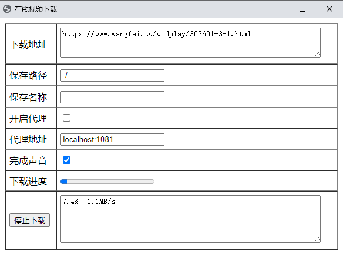

## m3u8资源下载工具

## 工具介绍

* 必须: Google浏览器(Chrome),后续会增加火狐的支持
* 提供图形界面,使用lorca(https://github.com/zserge/lorca)实现,需要Google浏览器(Chrome)
* 提供爬虫功能,能爬取普通网页(支持js,动态加载,iframe)的所有m3u8资源,使用selenium(https://github.com/tebeka/selenium)
  实现,需要Google浏览器(Chrome),114.xxxx.xx及以下版本
* Chromedriver驱动版本目前(2023-12)只支持v114.xxxx.xx及以下版本的浏览器
* Chrome历史版本下载地址(https://www.slimjet.com/chrome/google-chrome-old-version.php)
* 目前只支持m3u8资源下载,后续增加其它类型的资源
* 下载完成后,默认后缀为.ts
* 显示下载进度,下载用时
* 可以设置代理,及下载提示音

## 使用说明

* [工具下载.windows](https://github.com/injoyai/downloader/releases/latest/download/downloader.exe)
* 下载地址(例 http://devimages.apple.com.edgekey.net/streaming/examples/bipbop_4x3/gear2/prog_index.m3u8)
  或者普通网页地址(例 https://www.wangfei.tv/vodplay/302601-3-1.html)
* 保存名称可选,存在相同名字文件会被覆盖
* 等待进度条完成,或显示下载成功xxx ,则完成下载
  

## 测试结果

| 网站                     | m3u8 | html | 说明                                                              | 测试地址                                                                                       | 测试时间       |
  |------------------------|------|------|-----------------------------------------------------------------|--------------------------------------------------------------------------------------------|------------|
| 任意HLS资源(.m3u8)         | √    | -    | HLS,后缀是.m3u8即可                                                  | http://devimages.apple.com.edgekey.net/streaming/examples/bipbop_4x3/gear2/prog_index.m3u8 | -          |
| https://www.acfun.cn   | √    | √    | 一个页面有多个资源,不同清晰度,会全部下载                                           |      https://www.acfun.cn/v/ac43408539                                                                                      | 2024-01-05          |
| https://www.wangfei.tv | √    | √    | 中规中矩                                                            | https://www.naifei.art/vodplay/391559-1-1.html                                             | 2024-01-05 |
| https://www.91porn.com | √    | √    | 有一天15次限制,正则VID=[0-9]+,得到https://cdn77.91p49.com/m3u8/%s/%s.m3u8 |                                                                                            | -          |
| https://zxzj.vip       | √    | √    | 网页有iframe嵌套                                                     |                                                                                            | -          |
| https://jable.tv       | √    | √    |                                                                 |                                                                                            | 2023-12-28 |
| https://51cg.fun       | √    | √    |                                                                 |                                                                                            | 2023-12-29 |

## 更新说明

2023-12-30: 新增1个点赞,更新一波,更新文档,增加测试网站,整洁代码,浏览器驱动不配置自动修复(待完成)

## 常见问题

1. 开始能正常使用的爬虫功能,一段时间后却不能使用了,可能原因是浏览器升级了,驱动版本不兼容,解决方法删除驱动文件chromedriver.exe,并重新打开工具
2. 最近发现最新浏览器版本太高,驱动还未适配,爬虫功能需要卸载流浪器并重新安装老版本浏览器,历史版本下载地址(https://www.slimjet.com/chrome/google-chrome-old-version.php)
   然后禁止浏览器升级,默认安装的话,在C:\Program Files (x86)\Google\Update\,把GoogleUpdate.exe设置禁止执行(右键-属性-安全,全部设置成拒绝执行)