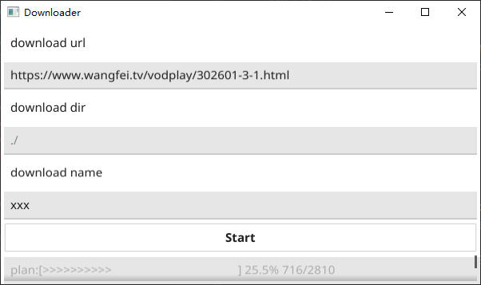

## m3u8资源下载工具
* 为了减小体积,使用了upx进行压缩,可能会报毒
* 尽量用的原生写的,代码会相对比较多
* 提供图形界面,使用fyne.io/fyne/v2(https://fyne.io/fyne/v2)实现,不能显示中文
* 目前只支持m3u8资源下载
* 如果不需要GUI,可以直接作为包使用, download.New()
* 如果安装了Chrome,工具会下载chromedriver.exe到根目录,提供爬虫功能,能爬取普通网页(支持js,动态加载)的所有m3u8资源
* 
* 下载完成后,默认后缀为.ts,修改成mp4也可
* 显示下载进度,下载用时
* 测试结果

  |网站|m3u8|html|
  |---|---|---|
  |任意.m3u8资源|通过|X|
  |https://www.acfun.cn|通过|通过|
  |https://www.wangfei.tv|通过|通过|

## 使用说明
* [版本下载.windows](https://github.com/injoyai/downloader/releases )
* 运行,如果安装了Chrome,工具会下载chromedriver.exe到根目录,提供爬虫功能,能爬取普通网页(支持js,动态加载)的所有m3u8资源
* download url 是下载地址(例 http://devimages.apple.com.edgekey.net/streaming/examples/bipbop_4x3/gear2/prog_index.m3u8)
* 或者普通网页地址(例 https://www.wangfei.tv/vodplay/302601-3-1.html)
* download name 是重命名文件(可选,xx,xx.ts,xx.mp4) ,存在相同名字文件会被覆盖
* 等待进度条完成,或显示Download success Used xxx ,则完成下载
* 